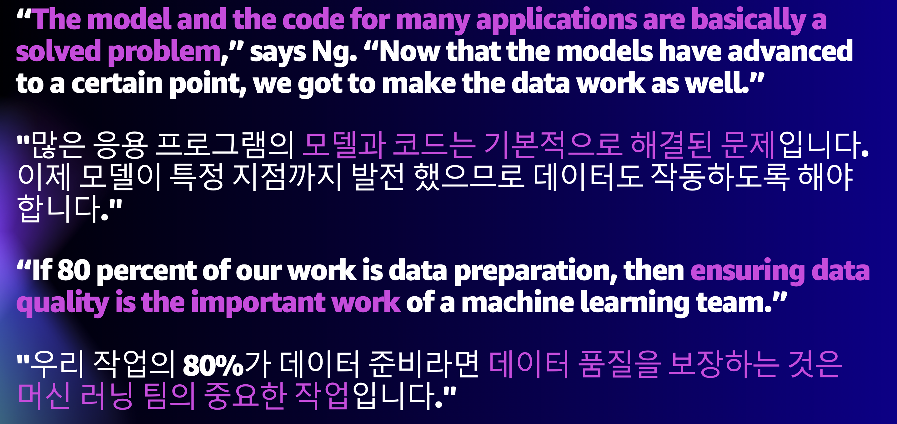
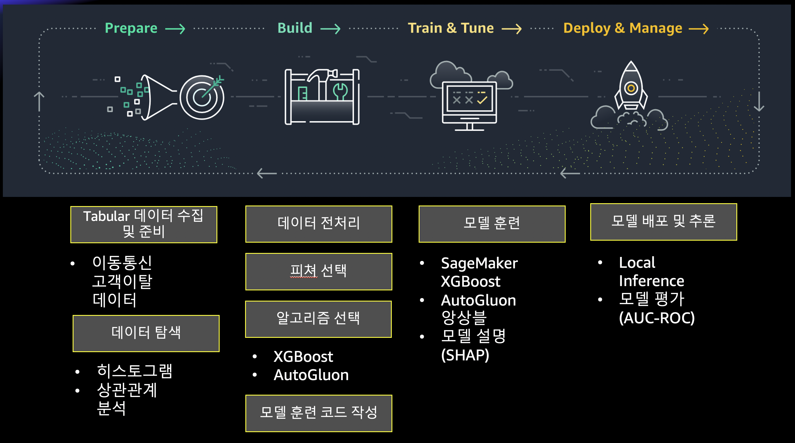
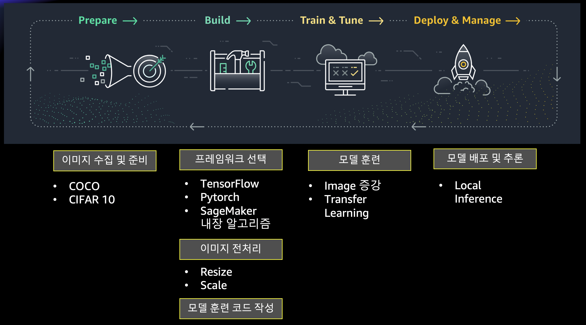

---
# ML 데이터 준비 및 ML Workflow 프로토 타이핑
---
<pre></pre>
# 1. 워크샵 배경
---
## 1.1 Andrew Ng 의 **"데이터 준비"** 의 중요성에 대한 의견
 ML Workflow 를 개발하기 위해서는 "ML 데이터 준비" (데이터 수집, 정제, 탐색, 분석, 이해 및 정리) 를 하는 과정이 약 80% 정도를 
차지 한다고 합니다. Andrew Ng 는 "From Model-Centric To Data-Centric" 으로 바꾸어야 한다고 합니다. 이유는 많은 ML 알고리즘 및 코드는 많이 발전하였고, 이미 검증이 되었다고 합니다. 하지만 "데이터 준비" 는 많이 과소평가 되고, "낮은 데이터 품질" 로 인해서 ML Workflow의 개발 속도의 저하 및 Production 시에 낮은 모델 추론 성능이 나온다고 합니다.




#### 소스:
- Andrew Ng Launches A Campaign For Data-Centric AI (Dec 6, 2021)
    - https://www.forbes.com/sites/gilpress/2021/06/16/andrew-ng-launches-a-campaign-for-data-centric-ai/?sh=2dee9f3574f5
- A Chat with Andrew on MLOps: From Model-centric to Data-centric AI (Mar 2021)
    - https://www.youtube.com/watch?v=06-AZXmwHjo
- Data Prep Still Dominates Data Scientists’ Time, Survey Finds, July 2020
    - https://www.datanami.com/2020/07/06/data-prep-still-dominates-data-scientists-time-survey-finds/
- Cleaning Big Data: Most Time-Consuming, Least Enjoyable Data Science Task, Survey Says, Mar 2016
    - https://www.forbes.com/sites/gilpress/2016/03/23/data-preparation-most-time-consuming-least-enjoyable-data-science-task-survey-says/?sh=6a0651e26f63


# 2. 워크샵 개요
---
머신 러닝 문제의 해결을 위해서는 문제 정의, 데이타 준비, 모델 훈련 알고리즘 선정, 모델 훈련, 튜닝, 모델 배포 및 추론의 기본 ML Workflow가 있습니다.  ML Workflow 를 개발하기 위해서는 "ML 데이터 준비" (데이터 수집, 정제, 탐색, 분석, 이해 및 정리) 를 하는 과정이 약 80% 정도를 차지 한다고 합니다. 이번 세션에서는 테블러 (Tabular) 및 아미지에 대한  데이터 준비를 통하여 ML Workflow 프로토타이핑을 해보겠습니다. 테블러 데이터는 “고객 이탈” 데이터를 준비해서, SageMaker XGBoost, AutoGluon 을 통해 모델 훈련을 하고 로컬 추론을 합니다. 이미지 데이터는 COCO, Cifar 10 데이터를 준비하여 Tensorflow, Pytorch, SageMaker 내장 알고리즘을 통해서 모델 훈련을 각각 하고, 로컬에서 추론을 하는 ML 프로토타이핑 을 배우겠습니다.


 **이 워크샵에서는 Tabular(CSV 포맷) 및 이미지 데이터의 준비를 SageMaker Notebook 을 통해서 빠른 ML 프로토타이핑을 실습 해보는 과정을 준비 했습니다.**


    


## 2.1 Tabular(CSV 포맷) 데이터 준비 및 ML 프로토 타이핑


## 2.2 이미지 준비 및 ML 프로토 타이핑


# 3. 주요 소스 코드
---

```
 |-tabular
 | |-1.1.xgb_churn.ipynb 
     - 고객 이탈 데이터를 준비, SageMaker XGBoost 훈련, 로컬 추론, SHAP 분석 함.
 | |-1.2.autogluon_churn.ipynb
     - 고객 이탈 데이터를 준비, AutoGluon Tabular 훈련, 로컬 추론, 피쳐 중요도 확인
 | |-src
 | | |-train_xgb.py
     - 1.1.xgb_churn.ipynb  의 XGBoost 훈련 코드
 | | |-tabular_utils.py
     - 유틸리티 함수들

 |-image-classificaton
 | |-1.1.download_data.ipynb
     - COCO, Cifar 10 데이터 준비
 | |-1.2.structuring_data.ipynb
     - 이미지 분류 폴더 생성 및 이미지 복사
     
 | |-2.1.builtin_preprocessing.ipynb 
     - SageMaker 내장 이미지 분류 알고리즘을 위해 RecordIO 파일 생성
 | |-2.2.builtin_training.ipynb 
     - SageMaker 내장 이미지 분류 알고리즘으로 모델 훈련
     
 | |-3.1.tensorflow_preprocessing.ipynb 
     - TFRecord 파일 생성
 | |-3.2.tensorflow_training.ipynb 
     - SageMaker Tensorflow 프레임워크로 훈련, 로컬 추론
 | |-training_tensorflow
 | | |-tensorflow_train.py
     - 3.2.tensorflow_training.ipynb 에서 사용한 Tensforflow 훈련 코드
 | | |-requirements.txt     
     - 파이썬 디펜던시 파일

     
 | |-4.1.pytorch_preprocessing.ipynb 
     - 이미지 리사이징 하여 저장
 | |-4.2.pytorch_training.ipynb
     - SageMaker PyTorch 프레임워크로 훈련, 로컬 추론      
 | |-training_pytorch
 | | |-pytorch_train.py
     - 4.1.pytorch_preprocessing.ipynb  에서 사용한 PyTorch 훈련 코드
     
 | |-src
 | | |-m_utils.py
     - 유틸리티 함수들
``` 

# A. 참조 자료
---
## 공통
- AWS SageMaker Examples / Pred_Data
    - https://github.com/aws/amazon-sagemaker-examples/tree/master/prep_data
- Amazon SageMaker 개발자 가이드
    - https://docs.aws.amazon.com/ko_kr/sagemaker/latest/dg/whatis.html
- Amazon SageMaker Python SDK
    - https://sagemaker.readthedocs.io/en/stable/
- AWS Boto3 SageMaker API
    - https://boto3.amazonaws.com/v1/documentation/api/latest/reference/services/sagemaker.html
    


## Tabular (CSV 형식의 데이터)
- Customer churn prediction with SageMaker XGBoost
    - https://github.com/mullue/churn-pred-xgboost
- Pandas Profiling
    - https://pandas-profiling.github.io/pandas-profiling/docs/master/rtd/
- Tablur Data (CSV 데이터) 피쳐 선택 기본 가이드
    - https://github.com/gonsoomoon-ml/Self-Study-On-SageMaker/blob/main/data_preparation/Feature_Selection_Guide.md
- AutoGluon Quick Start
    - https://github.com/mullue/autogluon


## Image
- COCO Dataset
    - https://cocodataset.org
- The CIFAR-10 dataset
    - https://www.cs.toronto.edu/~kriz/cifar.html
- SageMaker built-in Image Classification Algorithm
    - https://docs.aws.amazon.com/sagemaker/latest/dg/image-classification.html    
- TensorFlow Datasets 공식 페이지
    - https://www.tensorflow.org/datasets/overview
- SageMaker-Tensorflow-Step-by-Step 워크샵 
    - 세이지 메이커 TF Getting Started, Horovod, Data Distributed Parallelism 포함
    - https://github.com/gonsoomoon-ml/SageMaker-Tensorflow-Step-By-Step    
* SageMaker-PyTorch-Step-By-Step
    * 세이지 메이커 Pytorch Getting Started, Horovod, Data Distributed Parallelism 포함
    * https://github.com/gonsoomoon-ml/SageMaker-PyTorch-Step-By-Step

    

    